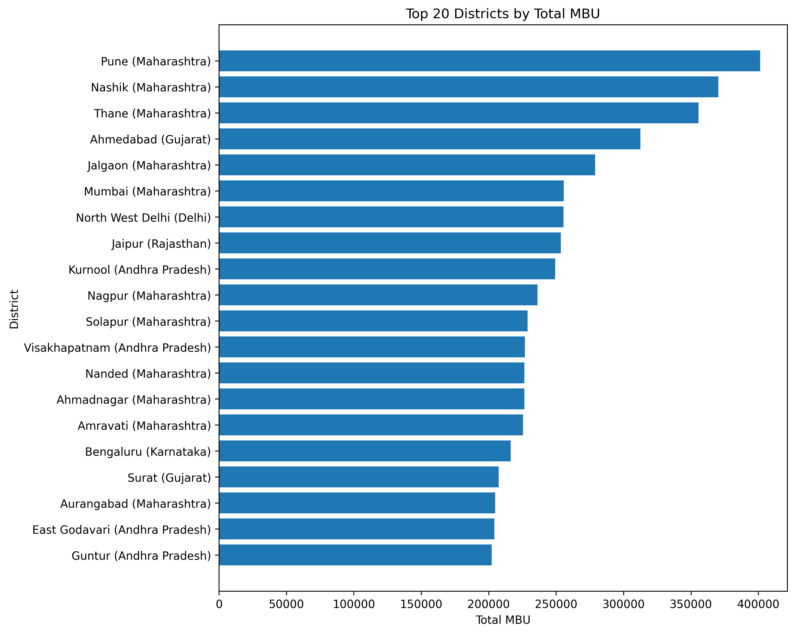
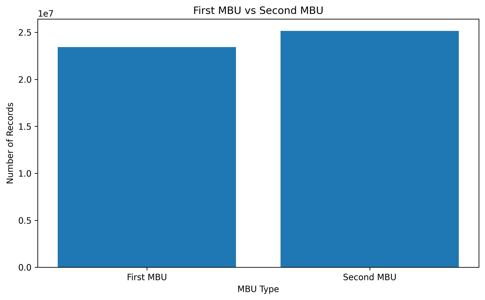
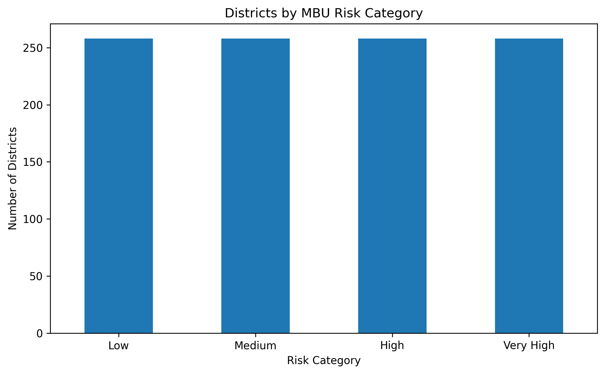
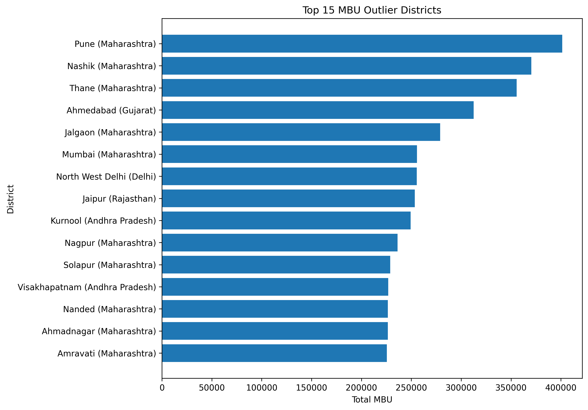
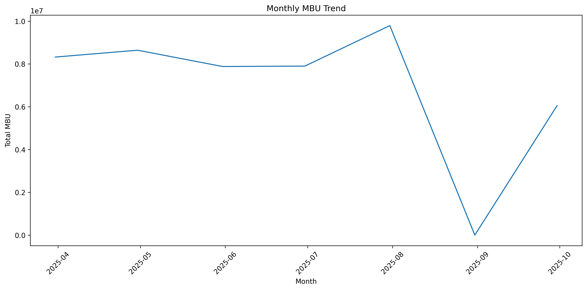
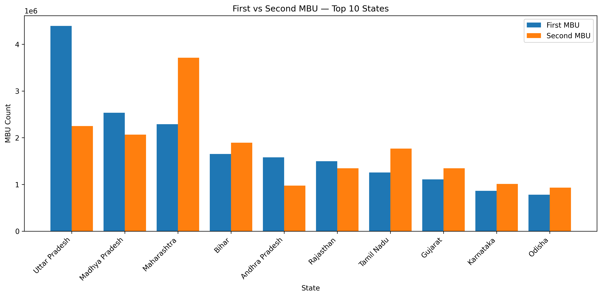

# Aadhaar MBU Analytics

## Project Overview

This project analyzes Aadhaar Mandatory Biometric Update (MBU) data to identify geographic patterns, high-volume districts, trends over time, and areas that may require focused intervention.

The analysis uses Aadhaar biometric update records and applies data cleaning, exploratory data analysis, statistical segmentation, and visualization techniques.

## Business Objective

The objective of this project is to:

- Analyze Mandatory Biometric Update activity across states and districts
- Compare First MBU and Second MBU volumes
- Identify districts with exceptionally high MBU activity
- Analyze monthly MBU trends
- Segment districts based on MBU volume
- Generate insights that can support targeted awareness and enrollment planning

## Dataset

The analysis is based on an Aadhaar biometric dataset containing:

- Date
- State
- District
- Pincode
- Biometric updates for age 5–17
- Biometric updates for age 17+

The raw dataset is stored in:

`data/raw/`

The cleaned dataset is stored in:

`data/processed/`

## Data Cleaning

The following steps were performed:

1. Loaded the raw CSV dataset using Pandas
2. Checked dataset structure and data types
3. Checked missing values
4. Identified and removed duplicate records
5. Checked for negative biometric update values
6. Validated state and district names
7. Converted the date column to datetime format
8. Created a `total_mbu` analytical column

### Cleaning Results

- Original records: 500,000
- Duplicate records removed: 10,318
- Final cleaned records: 489,682
- Missing values: 0
- Negative biometric values: 0

## Key Analysis

### Overall MBU Volume

- First MBU: 23,430,272
- Second MBU: 25,155,296
- Total MBU: 48,585,568

Second MBU volume is higher than First MBU volume in the analyzed dataset.

### Geographic Analysis

The analysis identifies states and districts with the highest absolute MBU volumes.

The top five districts identified were:

| Rank | State | District | Total MBU |
|---|---|---|---:|
| 1 | Maharashtra | Pune | 401,271 |
| 2 | Maharashtra | Nashik | 370,277 |
| 3 | Maharashtra | Thane | 355,678 |
| 4 | Gujarat | Ahmedabad | 312,460 |
| 5 | Maharashtra | Jalgaon | 278,886 |

Four of the top five districts are located in Maharashtra.

### Outlier Analysis

An IQR-based statistical method was used to identify districts with unusually high MBU volumes.

- Upper outlier threshold: 174,459.875
- Number of outlier districts: 27

### District Segmentation

Districts were segmented into four relative MBU-volume categories using quartiles:

- Low
- Medium
- High
- Very High

## Visualizations

### Top 20 Districts



### First vs Second MBU



### District Risk Categories



### Top MBU Outliers



### Monthly MBU Trend



### State-level First vs Second MBU



## Key Insights

1. The dataset contains 48.59 million total MBU records after duplicate removal.
2. Second MBU volume is higher than First MBU volume.
3. Pune has the highest total MBU volume among the analyzed districts.
4. Four of the five highest-volume districts are in Maharashtra.
5. IQR-based analysis identified 27 districts with unusually high MBU volumes.
6. Monthly analysis was performed to identify changes in MBU activity over time.

## Limitations

The analysis focuses on absolute MBU volumes.

High MBU volume does not necessarily mean higher non-compliance because the analysis does not include population or eligible beneficiary counts for calculating a population-adjusted rate.

Therefore, the findings should be interpreted as areas of high MBU activity rather than definitive measures of Aadhaar MBU non-compliance.

## Tools & Technologies

- Python
- Pandas
- NumPy
- Matplotlib
- Google Colab
- GitHub
- Exploratory Data Analysis
- Statistical Analysis
- Data Visualization

## Project Structure

```text
aadhaar-mbu-analytics/
│
├── data/
│   ├── raw/
│   └── processed/
│       ├── aadhaar_mbu_cleaned.csv
│       └── mbu_outlier_districts.csv
│
├── notebooks/
│   └── 01_data_cleaning.ipynb
│
├── visuals/
│   ├── top_20_districts.png
│   ├── first_vs_second_mbu.png
│   ├── district_risk_categories.png
│   ├── top_15_mbu_outliers.png
│   ├── monthly_mbu_trend.png
│   └── top_10_states_mbu_comparison.png
│
└── README.md
